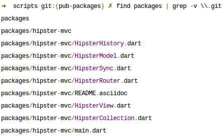

!SLIDE incremental

# Dart Packaging: "Pub"

 * Think npm or bundler
 * But for _client-side_ applications

!SLIDE

# Dart Code

    @@@ Javascript
    #import('Collections.Comics.dart', prefix: 'Collections');
    #import('Views.Comics.dart', prefix: 'Views');
    #import('Views.AddComic.dart', prefix: 'Views');

    #import('dart:html');
    #import('dart:json');

    #import('https://raw.github.com/eee-c/hipster-mvc/master/HipsterSync.dart');

    main() {
      // HipsterSync.sync = localSync;

      var my_comics_collection = new Collections.Comics()
        , comics_view = new Views.Comics(
            el:'#comics-list',
            collection: my_comics_collection
          );

      my_comics_collection.fetch();

      new Views.AddComic(
        el:'#add-comic',
        collection: my_comics_collection
      );
    }

!SLIDE

# Dart: Just the Code

    @@@ Javascript
    main() {
      // HipsterSync.sync = localSync;

      var my_comics_collection = new Collections.Comics()
        , comics_view = new Views.Comics(
            el:'#comics-list',
            collection: my_comics_collection
          );

      my_comics_collection.fetch();

      new Views.AddComic(
        el:'#add-comic',
        collection: my_comics_collection
      );
    }

!SLIDE

# Dart Imports (built-in awesome)

    @@@ Javascript
    #import('Collections.Comics.dart', prefix: 'Collections');
    #import('Views.Comics.dart', prefix: 'Views');
    #import('Views.AddComic.dart', prefix: 'Views');

    #import('dart:html');
    #import('dart:json');

    #import('https://raw.github.com/eee-c/hipster-mvc/master/HipsterSync.dart');

!SLIDE

# Dart with Packaging

    @@@ Javascript
    #import('Collections.Comics.dart', prefix: 'Collections');
    #import('Views.Comics.dart', prefix: 'Views');
    #import('Views.AddComic.dart', prefix: 'Views');

    #import('dart:html');
    #import('dart:json');

    #import('package:hipster-mvc/HipsterSync.dart');

    main() {
      // HipsterSync.sync = localSync;

      var my_comics_collection = new Collections.Comics()
        , comics_view = new Views.Comics(
            el:'#comics-list',
            collection: my_comics_collection
          );

      my_comics_collection.fetch();

      new Views.AddComic(
        el:'#add-comic',
        collection: my_comics_collection
      );
    }

!SLIDE

# The Pub Difference

    @@@ Javascript
    // Instead of:
    // #import('https://raw.github.com/eee-c/hipster-mvc/master/HipsterSync.dart');

    // Use
    #import('package:hipster-mvc/HipsterSync.dart');

!SLIDE

# Where the Magic Happens: pubspec

    @@@ YAML
    dependencies:
      hipster-mvc:
        git: git://github.com/eee-c/hipster-mvc.git

!SLIDE

# Installing with pub

!SLIDE

# Installing with pub

!SLIDE

# The "packages" Directory

!SLIDE

# Local Development

!SLIDE

# But...

 * It's still very early
 * No central repository
 * "Dumb" dependency resolution
 * Only works with git
